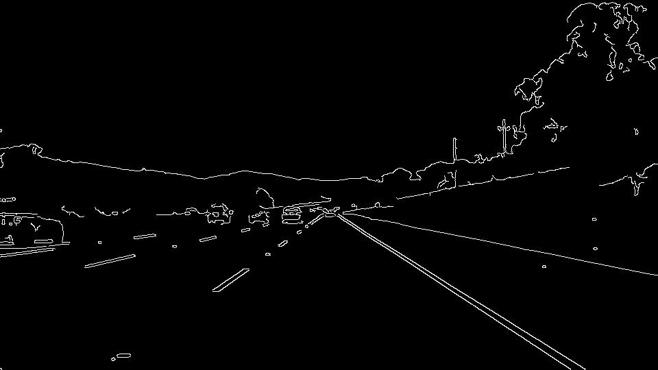

# **Finding Lane Lines on the Road** 

The file is in repository [Github](https://github.com/JeonghwaLee-TwinDAD/CarND-Detect_Lanes_Basic/test_videos/solidYellowLeft.mp4)

---

**Finding Lane Lines on the Road**

The goals / steps of this project are the following:
* Make a pipeline that finds lane lines on the road
* Reflect on your work in a written report

---

### Reflection

##### 1. Describe your pipeline. As part of the description, explain how you modified the draw_lines() function.

* My pipeline consisted of 6 steps as follows: 

Step 1: Apply grayscaling the images,

Step 2: Apply Gaussian noise kernel,
 
Step 3: Apply Canny transform,

Step 4: Apply image mask based on region of interest,

Step 5: Apply Hough transform, cut off lines based region of interest.

Step 6: Apply weighted images.

## Describe the draw_lines()
In order to draw a single line on the left and right lanes, I modified the draw_lines() function by the following steps:

**Step 1**: Detect the right and left lines separetely by rough estimation of slope ((y2-y1)/(x2-x1)). 

**Step 2**: Average the position of each of the lines by least-squares method. (ex. average_slope_intercept(img, lines))

**Step 3**: Extrapolate the lines to the top and bottom of the lane based on region of interest.(ex. np.polyfit((x1,x2), (y1,y2), 1))

### 2. Identify potential shortcomings with your current pipeline

* One potential shortcoming would be what would happen when the vehicle goes into a steep curve.

* Another shortcoming could be what would happen when the lines are consist of a series of bott's dot.

### 3. Suggest possible improvements to your pipeline

* I would think about exrapolation for high DoF to improve the curve fitting at the left lane and right one by polynomial approximation. 

